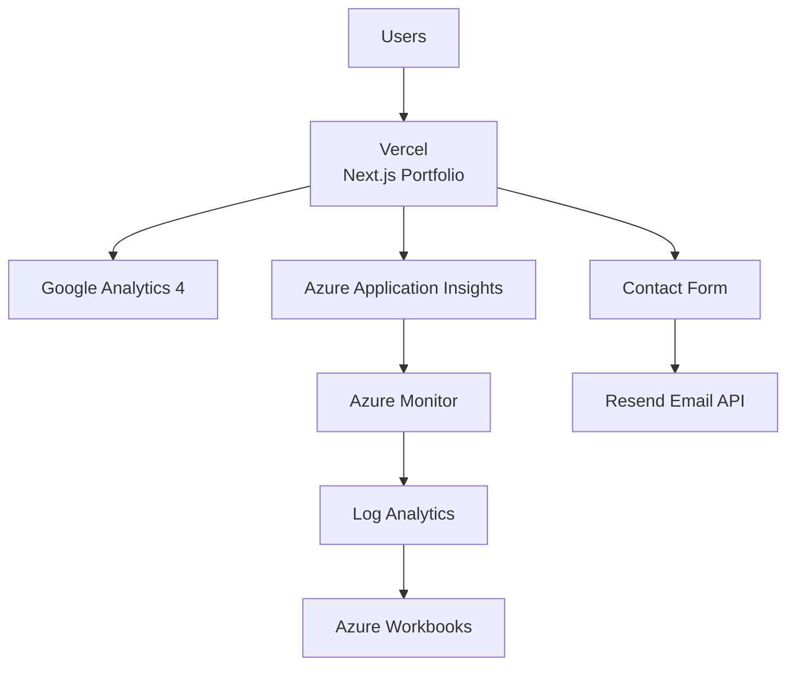

# Othmane Aoubid | Full-Stack Developer Portfolio

A modern, multilingual portfolio website built with Next.js 16, featuring comprehensive monitoring, analytics, and SEO optimization.

**Live Demo**: https://othmanead.vercel.app/en

---

## Features

- **Multi-language Support**: English, French, and Arabic with RTL support
- **Contact Form**: Secure email delivery via Resend with rate limiting and honeypot protection
- **Projects Showcase**: Interactive project gallery with detailed views
- **Services**: Professional services overview
- **SEO Optimization**: IndexNow integration, sitemap generation, robots.txt
- **Analytics**: Multi-platform tracking (Vercel, Google Analytics, Azure Application Insights)
- **Security**: Content Security Policy, rate limiting, input validation

---

## Tech Stack

### Frontend
- **Framework**: Next.js 16.2.6 (App Router)
- **Language**: TypeScript 5
- **Styling**: Tailwind CSS 4
- **UI Components**: Radix UI (Dialog, Tabs)
- **Animations**: Framer Motion 12
- **Icons**: Lucide React
- **Markdown**: react-markdown with remark-gfm
- **Math Rendering**: KaTeX
- **Search**: Fuse.js

### Backend
- **Email Service**: Resend
- **Runtime**: Node.js

### Deployment
- **Platform**: Vercel
- **Region**: Paris (cdg1)
- **Cron Jobs**: IndexNow submission (daily at 6:00 UTC)

### Monitoring & Analytics
- **Vercel Analytics**: Page views and performance metrics
- **Vercel Speed Insights**: Core Web Vitals
- **Google Analytics**: Event tracking via @next/third-parties
- **Azure Application Insights**: Custom events, page views, exceptions

### Internationalization
- **Library**: next-intl 4.12.0
- **Languages**: English (default), French, Arabic
- **RTL Support**: Automatic direction handling for Arabic

---

## 🏗️ Architecture

The portfolio is built with **Next.js 16** and deployed on **Vercel**. User interactions and application performance are monitored with **Azure Application Insights**, where telemetry is stored in **Azure Monitor Logs** and analyzed through **Azure Workbooks** using **Kusto Query Language (KQL)**. Website analytics are also collected with **Google Analytics 4**, while the contact form uses **Resend** to deliver emails.



---

## Project Structure (Brief)

```
portfolio_2/
├── messages/              # i18n translations (en, fr, ar)
├── public/               # Static assets
├── src/
│   ├── app/              # Next.js App Router
│   │   ├── [locale]/    # Localized routes
│   │   ├── api/         # API routes (contact, indexnow, og)
│   │   └── layout.tsx   # Root layout
│   ├── components/       # React components
│   ├── i18n/            # Internationalization config
│   └── lib/             # Utilities and data
├── next.config.ts
├── package.json
└── vercel.json
```

---

## 🚀 Deployment

The application is deployed on **Vercel**, providing automatic builds and global edge delivery for every production deployment.

Application telemetry is collected through **Azure Application Insights**, stored in **Azure Monitor Logs**, and visualized using **Azure Workbooks**. Website traffic and user engagement are also measured with **Google Analytics 4**, while the contact form is powered by **Resend** for reliable email delivery.

---

## Monitoring & Observability

### Azure Application Insights

The application uses Azure Application Insights for comprehensive monitoring:

**Custom Events Tracked:**
- CV downloads
- GitHub/LinkedIn/WhatsApp clicks
- Contact form submissions
- Project card clicks
- Project link clicks
- CTA clicks
- Language switches
- Theme switches
- Page scroll events
- Error occurrences

**Page Views:**
- Automatic route tracking enabled
- Page visit time tracking
- Request/response header tracking

**Configuration:**
- Connection string via `NEXT_PUBLIC_APPLICATIONINSIGHTS_CONNECTION_STRING`
- CORS correlation enabled
- AJAX performance tracking enabled
- Exception tracking enabled

**Note**: Custom event tracking is gated to production environment only via `isTrackingEnabled()` check.

---

## Analytics

### Google Analytics

Integrated via `@next/third-parties/google` with event tracking for:
- User interactions (clicks, form submissions)
- Page navigation
- Custom events matching Azure Application Insights

### Vercel Analytics

Automatic page view and performance tracking with:
- Web Vitals monitoring
- User analytics
- Geographic data

---

## Environment Variables

Required environment variables (see `.env.example`):

```bash
# SEO Verification
GOOGLE_SITE_VERIFICATION=
BING_SITE_VERIFICATION=

# Analytics
NEXT_PUBLIC_GA_MEASUREMENT_ID=
NEXT_PUBLIC_PLAUSIBLE_DOMAIN=
NEXT_PUBLIC_APPLICATIONINSIGHTS_CONNECTION_STRING=

# IndexNow
INDEXNOW_KEY=****************************************
CRON_SECRET=

# Contact Form
RESEND_API_KEY=****************************************
```

---

## Running Locally

### Prerequisites
- Node.js 20+
- npm or yarn

### Installation

```bash
# Install dependencies
npm install

# Copy environment variables
cp .env.example .env.local

# Edit .env.local with your values
```

### Development

```bash
# Run with webpack
npm run dev

# Run with turbopack (faster)
npm run dev:turbo

# Build for production
npm run build

# Start production server
npm start

# Run linter
npm run lint
```

Open [http://localhost:3000](http://localhost:3000) to view the application.

---

## Roadmap

### Future Enhancements
- [ ] Add dark/light theme persistence improvements
- [ ] Implement more interactive quiz features
- [ ] Add project case studies with detailed writeups
- [ ] Integrate additional analytics dashboards
- [ ] Add A/B testing capabilities
- [ ] Implement progressive web app features
- [ ] Add offline support
- [ ] Enhance accessibility (WCAG 2.1 AA compliance)

---

## License

This project is private. No license file is present in the repository.

---

## Author

**Othmane Aoubid**
- Full-Stack Developer & Cloud Engineer
- Based in Morocco
- Available for remote positions and freelance work
